# Q6 Explain Execution Context


## Code Snippet - 1


```javascript
console.log('First');
setTimeout(() => console.log('Second'), 0);
console.log('Third');
```


### Step-1


- First The Code Snippent is Evaluated. And Then The Execution Starts.


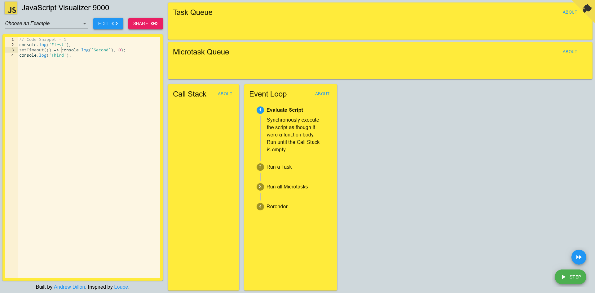


### Step-2


- The First Line is Executed and `First` is outputed to console.


### Step-3


- Then The Second Line is Executed in Which The setTimeout Method is intialized and executed which pushes  the anonymous arrow function we defined for outputing to console in to the task queue and waits time till time set by setTimeout is over.


### Step-4


- Then The Third Line is Executed and `Third` is outputed to console.


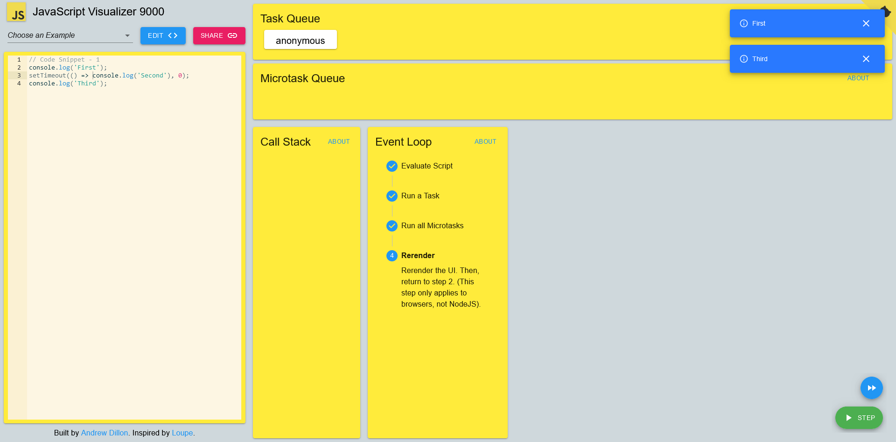


### Step-5


- Then The oldest task in the task queue is selected to be executed which here means the anonymous function we defined with setTimeout of 0. Because of setTimeout our arrow function is waiting in task queue to be executed.


### Step-6


- The task inside setTimeout was to execute our function for outputing to console. That function is pushed onto the call stack for execution. 


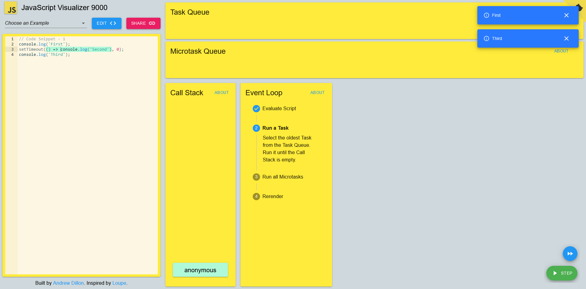


### Step-7


- Then the event loop executes the function that is on the top of the call stack which is the anonymous arrow function that console logs `Second`.


### Step-8


- After that if in browsers ui rerenders and then starts executing other tasks if in NodeJS it starts executing other tasks. And if no tasks remain programs stops.


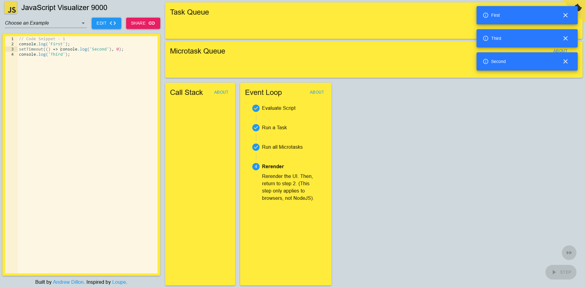


## Code Snippet - 2


```javascript
console.log('First');
function secondCall() {
    console.log('Second');
}
setTimeout(secondCall, 2000);
setTimeout(() => console.log('Third'), 0);
console.log('Third');
```


### Step-1


- First The Code Snippent is Evaluated. And Then The Execution Starts.


### Step-2


- The First Line is Executed and `First` is outputed to console.


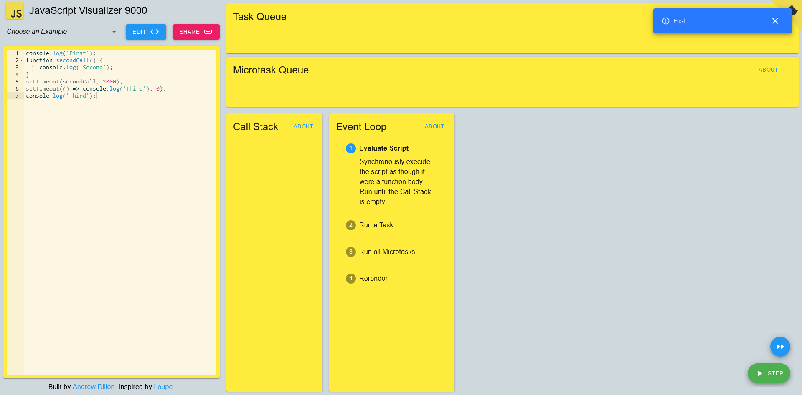


### Step-3


- Then On The Second Line the `secondCall` function is defined and then The Fifth Line is Executed in Which The setTimeout Method is intialized and executed which pushes the the anonymous arrow function we defined for outputing to console in to the task queue and waits time till time set by setTimeout is over.


### Step-4


- Then The Sixth Line is Executed in Which The setTimeout Method is intialized and executed which pushes the anonymous arrow function we defined for outputing to console in to the task queue and waits time till time set by setTimeout is over.


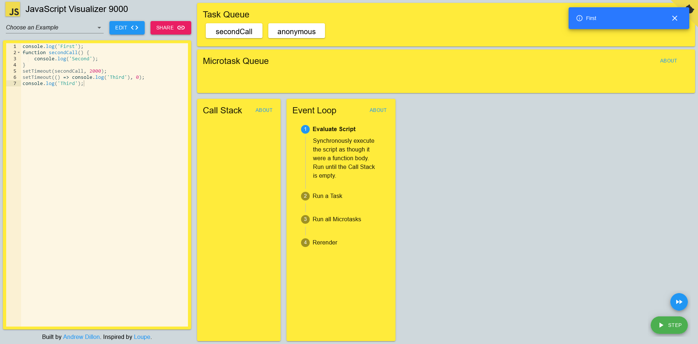


### Step-5


- The Seventh Line is Executed which outputs `Third` to console.


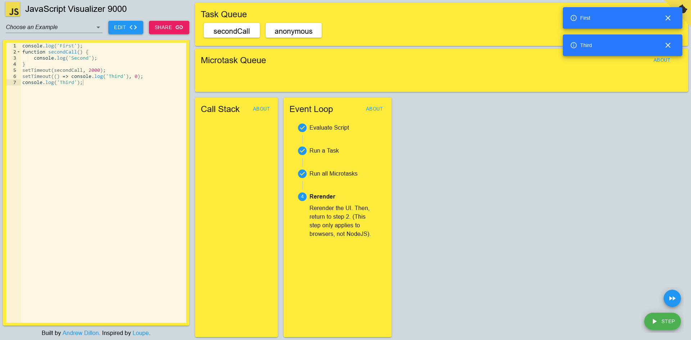


### Step-6


- Then The oldest task in the task queue is selected to be executed which here means the anonymous function we defined with setTimeout of 0. Because of setTimeout our arrow function is waiting in task queue to be executed.


### Step-7


- The task inside setTimeout was to execute our function for outputing to console. That function is pushed onto the call stack for execution. 


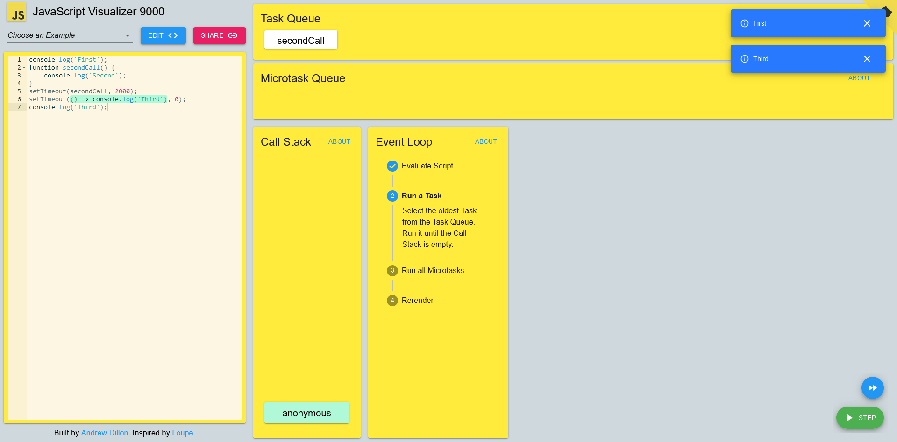


### Step-8


- Then the event loop executes the function that is on the top of the call stack which is the anonymous arrow function that console logs `Third`.


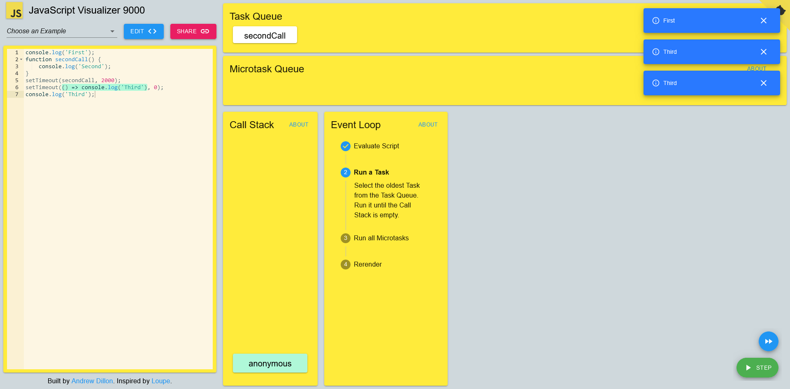


### Step-9


- Then if in browsers ui rerenders and then starts executing other tasks from Task Queue if in NodeJS it starts executing other Tasks from Task Queue.


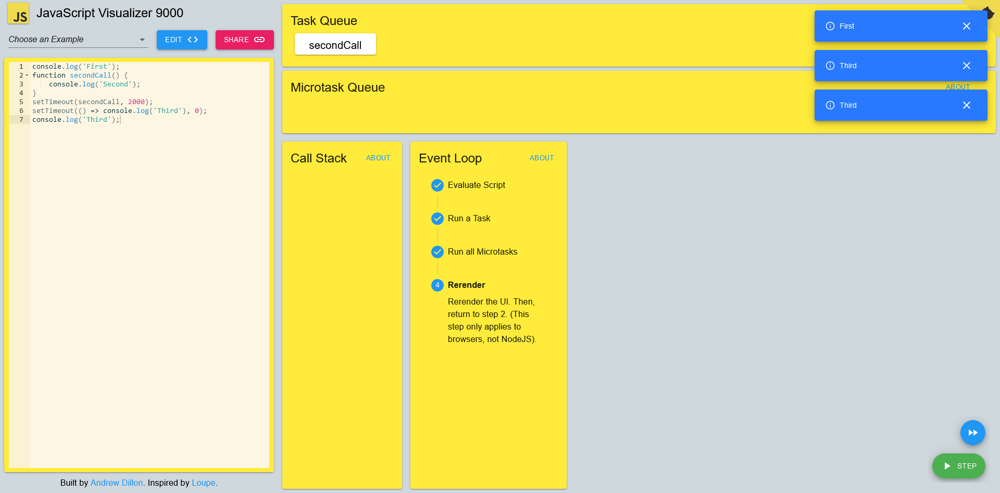


### Step-10


- Then The oldest task in the task queue is selected to be executed which here means the secondCall function we defined with setTimeout of 2000. Because of setTimeout our secondCall function is waiting in task queue to be executed.


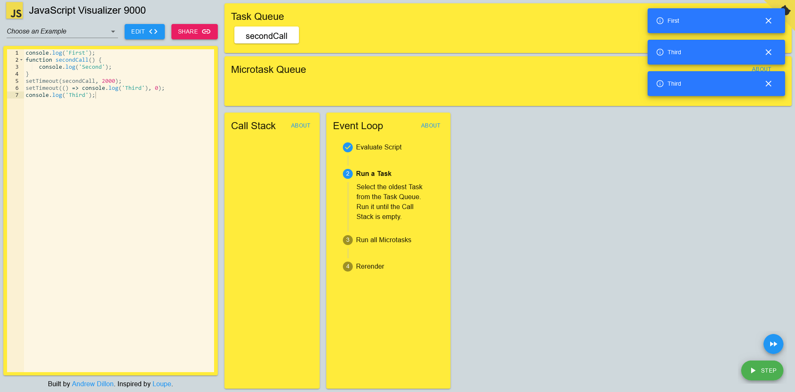


### Step-11


- The task inside setTimeout was to execute our secondCall function for outputing to console. That function is pushed onto the call stack for execution. 


### Step-12


- Then the event loop executes the function that is on the top of the call stack which is the secondCall function that console logs `Second`.


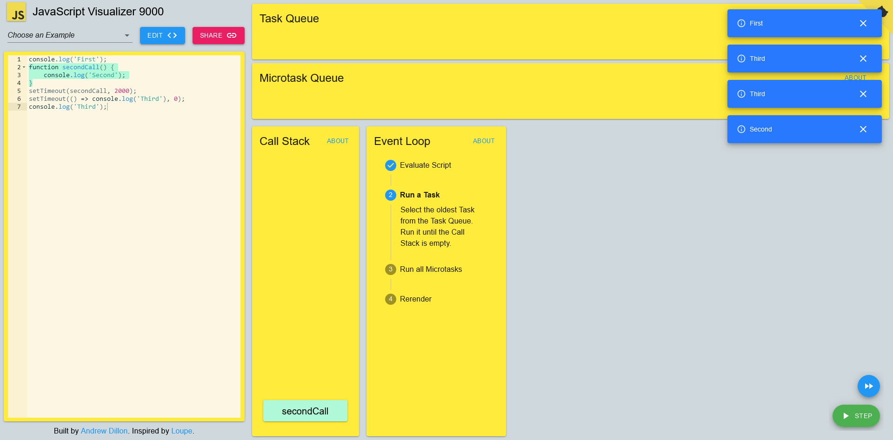


### Step-13


- After that if in browsers ui rerenders and then starts executing other tasks if in NodeJS it starts executing other tasks. And if no tasks remain programs stops.


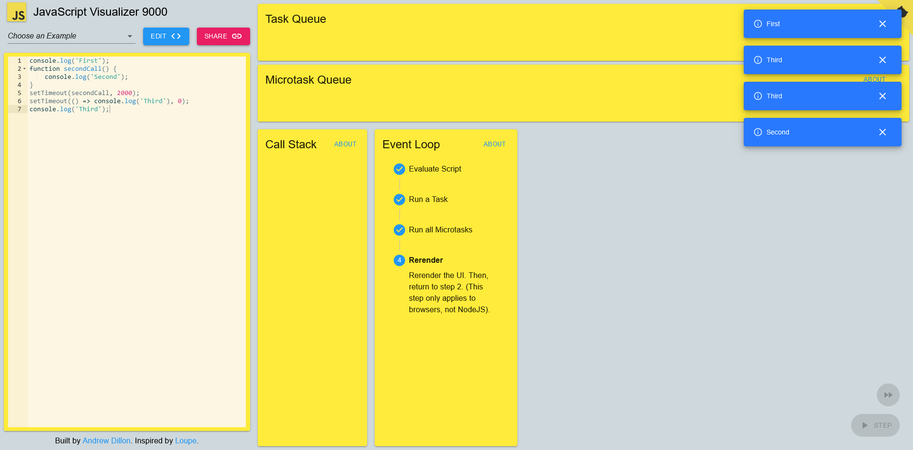